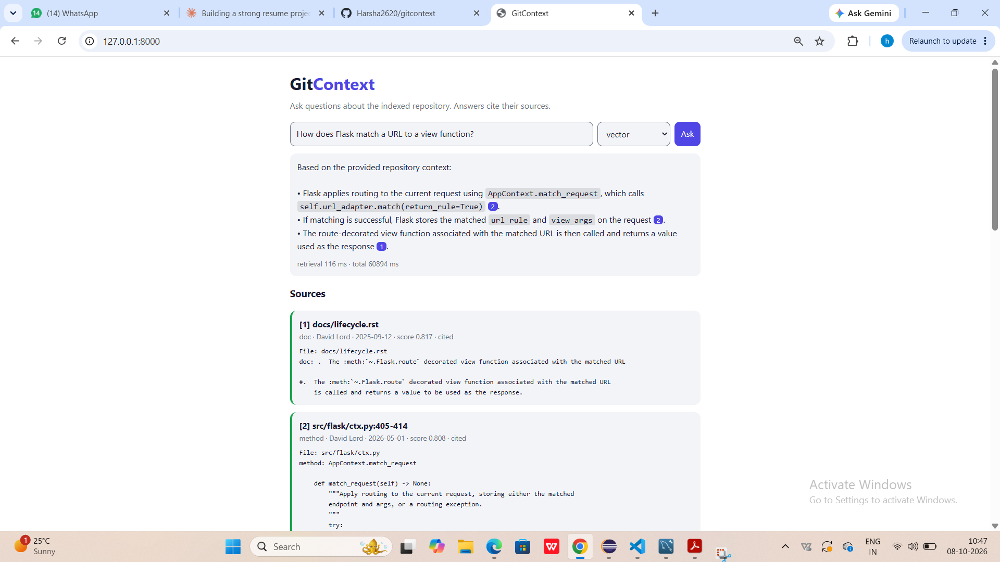
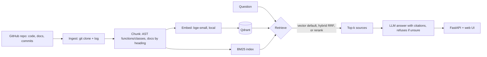

# GitContext



**Ask questions about any GitHub repository and get answers that cite their sources.**
GitContext indexes source code, docs and commit history, retrieves the most relevant pieces with semantic search
(optionally hybrid BM25 + cross-encoder reranking), and answers with an LLM that may only use the retrieved sources.

## Architecture


## Features
- **Code-aware chunking**: Python split by function/class using the AST; docs split by heading
- **Metadata** on every chunk: file path, lines, author, commit, last-modified date
- **4 retrieval modes**: `vector`, `bm25`, `hybrid` (Reciprocal Rank Fusion), `rerank` (cross-encoder)
- **Grounded answers**: numbered `[n]` citations, validated against the retrieved sources; replies "I don't know" when the sources do not contain the answer
- **Incremental updates**: `update` re-embeds only new/changed files and removes deleted ones
- **FastAPI backend + web UI**, CLI, tests and CI
- **Evaluation harness** with labelled questions (Recall@k, MRR, latency, error analysis)

## Quick start
```bash
python -m venv .venv
.venv\Scripts\Activate.ps1            # Mac/Linux: source .venv/bin/activate
pip install -r requirements.txt
copy .env.example .env                # add a free key (Groq or Google Gemini) to .env
python -m app.cli index https://github.com/pallets/flask
python -m app.cli ask "How does Flask match a URL to a view function?"
python -m uvicorn app.api:app --port 8000   # web UI at http://localhost:8000
python -m eval.run_eval --pool 15           # stop the server first
pytest
```
The LLM client works with any OpenAI-compatible API; configure `LLM_API_KEY`, `LLM_BASE_URL` and `LLM_MODEL` in `.env`.

## Keeping the index fresh
`python -m app.cli update <repo-url>` pulls the repo and compares the last-commit hash stored with every indexed file
against git. Only new and changed files are re-chunked and re-embedded, deleted files are removed and new commits are added.
Restart the web server afterwards so it reloads the index.

Tested by rewinding the local clone 25 commits: `update` detected 20 changed files and re-embedded only the affected chunks (342 chunks, 61 s);
pulling forward again re-embedded 337 chunks in 70 s. Unchanged files are skipped.

## Evaluation
`python -m eval.run_eval` runs 43 labelled questions (natural language, exact identifiers, docs how-to) against every retrieval mode.
A result counts as correct when a retrieved chunk matches the expected function/class name or file path.

Flask repo, k=5, retrieval only, laptop CPU, rerank pool of 15, index excluding `tests/`, `examples/` and `docs/conf.py`:

| Mode | Recall@1 | Recall@5 | MRR | Precision@5 | p50 latency | p95 latency |
|---|---|---|---|---|---|---|
| **vector (default)** | 79% | **93%** | **0.85** | 36% | 28 ms | 33 ms |
| bm25 | 58% | 88% | 0.71 | 30% | 1 ms | 2 ms |
| hybrid | **81%** | 91% | **0.85** | 37% | 29 ms | 31 ms |
| rerank | 70% | 88% | 0.78 | 34% | 1187 ms | 2290 ms |

Recall@5 by question type (vector / bm25 / hybrid / rerank):
natural (25): 96 / 92 / 92 / 88%, identifiers (10): 100 / 100 / 100 / 100%, docs how-to (8): 75 / 62 / 75 / 75%.

**Effect of removing test and boilerplate files from the index** (same questions, same Flask snapshot; before -> after):

| Mode | Recall@1 | Recall@5 | MRR |
|---|---|---|---|
| vector | 70% -> 79% | 91% -> 93% | 0.78 -> 0.85 |
| bm25 | 40% -> 58% | 79% -> 88% | 0.55 -> 0.71 |
| hybrid | 63% -> 81% | 88% -> 91% | 0.72 -> 0.85 |
| rerank | 65% -> 70% | 91% -> 88% | 0.75 -> 0.78 |

**Answer quality** (10 sampled questions plus 4 out-of-scope ones, vector retrieval + `gemini-3.5-flash-lite`): citation accuracy 90% (the answer cited a correct source and no invalid citations); the system refused 4 of 4 out-of-scope questions. Small sample: one question is 10 points.

**Findings**
- Error analysis showed that Flask's own `tests/` files and `docs/conf.py` crowded out real answers, so they are no longer indexed by default (`--include-tests` to keep them). Ranking quality improved in every mode (vector MRR 0.78 -> 0.85, Recall@1 70% -> 79%).
- Dense and hybrid retrieval are now tied (MRR 0.85, ~28 ms); vector stays the default because it is simpler and equally fast.
- The general-purpose cross-encoder reranker did not help: lower Recall@5 and MRR than vector at about 40x the latency.
- The three questions every mode misses are docs-style how-to questions (JSON parsing, organizing a large app with blueprints, configuration best practices). The top results are related code files rather than the labelled docs pages; I did not change these labels to avoid tuning the benchmark.

**Limitations**
- 43 questions, so one question is about 2.3 points (the Recall@5 changes above are 1 question; the Recall@1 and MRR changes are larger).
- Labels were written by me; after the first error analysis I corrected 2 labels (valid answers I had missed).
- Pull-request discussions and incident reports are not ingested (code, docs and commit history only).
- Latency varies between runs on a laptop CPU. Commit-history and error-message queries are not covered by the benchmark.

## Roadmap
- [x] Ingestion, AST chunking, embeddings, vector search
- [x] BM25 + hybrid retrieval (RRF) + reranking
- [x] Grounded LLM answers with validated citations
- [x] FastAPI backend + web UI
- [x] Evaluation harness with error analysis
- [x] Benchmark the filtered index (tests/examples excluded)
- [x] Incremental re-indexing (`update`: only new/changed files are re-embedded, deleted files removed)
- [ ] Ingest PR discussions and incident reports (GitHub API)
- [ ] Docker image and hosted demo
