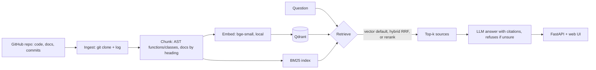

# GitContext

**Ask questions about any GitHub repository and get answers that cite their sources.**
GitContext indexes source code, docs and commit history, retrieves the most relevant pieces with semantic search
(optionally hybrid BM25 + cross-encoder reranking), and answers with an LLM that may only use the retrieved sources.

## Architecture


## Features
- **Code-aware chunking**: Python split by function/class using the AST; docs split by heading
- **Metadata** on every chunk: file path, lines, author, commit, last-modified date
- **4 retrieval modes**: `vector`, `bm25`, `hybrid` (Reciprocal Rank Fusion), `rerank` (cross-encoder)
- **Grounded answers**: numbered `[n]` citations, validated against the retrieved sources; replies "I don't know" when the sources do not contain the answer
- **FastAPI backend + web UI**, CLI, tests and CI
- **Evaluation harness** with labelled questions (Recall@k, MRR, latency, error analysis)

## Quick start
```bash
python -m venv .venv
.venv\Scripts\Activate.ps1            # Mac/Linux: source .venv/bin/activate
pip install -r requirements.txt
copy .env.example .env                # add a free key (Groq or Google Gemini) to .env
python -m app.cli index https://github.com/pallets/flask
python -m app.cli ask "How does Flask match a URL to a view function?"
python -m uvicorn app.api:app --port 8000   # web UI at http://localhost:8000
python -m eval.run_eval --pool 15           # stop the server first
pytest
```
The LLM client works with any OpenAI-compatible API; configure `LLM_API_KEY`, `LLM_BASE_URL` and `LLM_MODEL` in `.env`.

## Evaluation
`python -m eval.run_eval` runs 43 labelled questions (natural language, exact identifiers, docs how-to) against every retrieval mode.
A result counts as correct when a retrieved chunk matches the expected function/class name or file path.

Flask repo, k=5, retrieval only, laptop CPU, rerank pool of 15:

| Mode | Recall@1 | Recall@5 | MRR | Precision@5 | p50 latency | p95 latency |
|---|---|---|---|---|---|---|
| **vector (default)** | 70% | **91%** | **0.78** | 33% | 23 ms | 35 ms |
| bm25 | 40% | 79% | 0.55 | 25% | 1 ms | 2 ms |
| hybrid | 63% | 88% | 0.72 | 33% | 25 ms | 34 ms |
| rerank | 65% | **91%** | 0.75 | 33% | 1251 ms | 1290 ms |

Recall@5 by question type (vector / bm25 / hybrid / rerank):
natural (25): 96 / 80 / 92 / 92%, identifiers (10): 100 / 90 / 100 / 100%, docs how-to (8): 62 / 62 / 62 / 75%.

**Findings**
- Dense retrieval matched the cross-encoder on Recall@5 and had the best MRR at over 50x lower latency, so it is the default.
- BM25 alone is the weakest mode; hybrid did not beat dense retrieval on this benchmark.
- Documentation how-to questions are the weak spot; reranking helped there (75%).
- Error analysis showed that Flask's own `tests/` files and `docs/conf.py` often crowd out the real answer
  (for example "parse JSON", "write tests", "configuration best practices").
  Indexing now skips these by default (`--include-tests` to keep them); that change has not been benchmarked yet.

**Limitations**
- 43 questions, so one question is about 2.3 points; labels were written by me.
- After error analysis I corrected 2 labels (valid answers I had missed: the test client and logging questions); the table uses the corrected labels.
- The reported index still contained Flask's `tests/` folder.
- Latency varies between runs on a laptop CPU. Commit-history and error-message queries are not covered by the benchmark.

## Roadmap
- [x] Ingestion, AST chunking, embeddings, vector search
- [x] BM25 + hybrid retrieval (RRF) + reranking
- [x] Grounded LLM answers with validated citations
- [x] FastAPI backend + web UI
- [x] Evaluation harness with error analysis
- [ ] Benchmark the filtered index (tests/examples excluded)
- [ ] Incremental re-indexing of changed files
- [ ] Docker image and hosted demo
